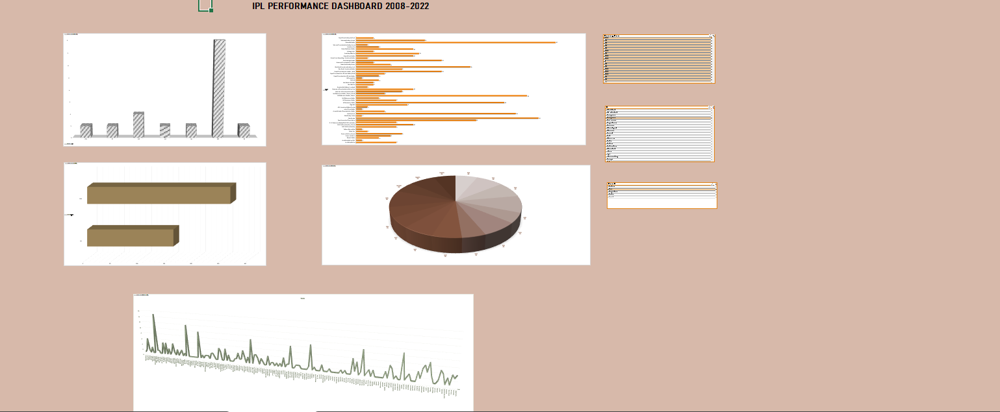

#Dashboard Preview

## 📊 Project Overview

An interactive IPL dashboard built using Microsoft Excel to analyze match data from 2008–2022.
The dashboard uses Pivot Tables, Charts, and Slicers to explore team performance, match trends, and key insights.

## ⚙️ Tools & Techniques

* Microsoft Excel
* Pivot Tables
* Slicers (interactive filtering)
* Data Cleaning
* Data Visualization

## 📈 Key Features

* Team-wise performance analysis
* Matches distribution by season
* Toss decision impact
* Interactive filtering using slicers

## 🎯 Key Insights

* Toss decisions influence match outcomes
* Certain teams dominate across seasons
* Match distribution varies by venue

## 📁 Files

* `IPL_Dashboard.xlsx` → Main dashboard file

## 🚀 How to Use

1. Download the Excel file
2. Open in Microsoft Excel
3. Use slicers to filter by season or team
4. Explore charts and insights

## 📌 Project Outcome

Developed an interactive dashboard to derive meaningful insights from IPL data using Excel.

